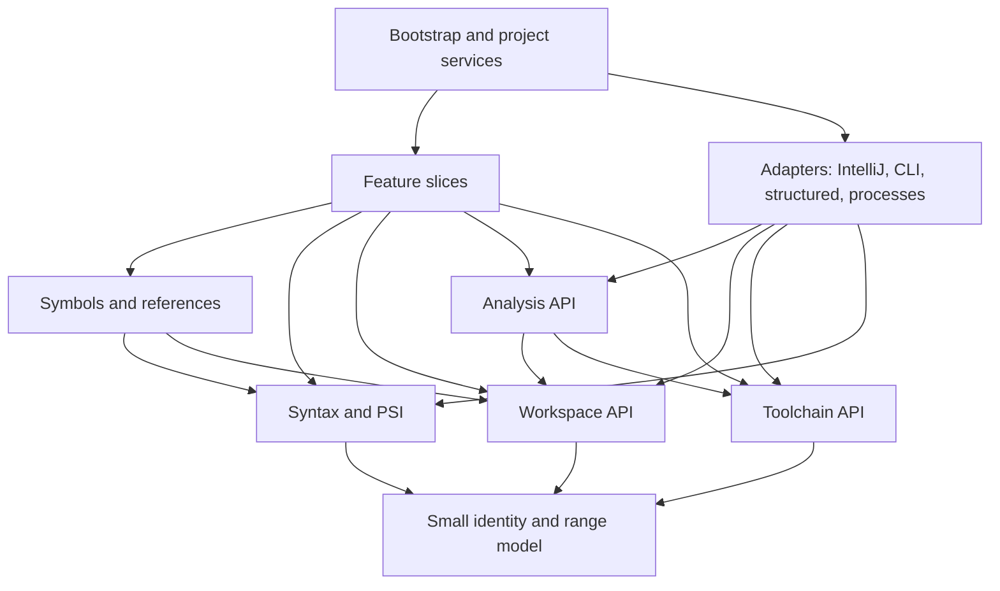

# Architecture for Bend IDEA

Status: implementation guidance, 2026-09-22. Scala 3 is the user-selected implementation language. The file-recognition scaffold implements the first boundary; most roadmap services below remain future work.

This proposal reviews all 47 GitHub issues: [the specification](https://github.com/dearlordylord/bend-idea/issues/1) and feature issues #2–#47. All were open and none had comments at review time. Issue numbers below are GitHub numbers; the numeric prefixes in issue titles are one lower. The approved specification remains the delivery authority. The subsequent user decision to use Scala 3 supersedes its Kotlin implementation choice; Bend remains the supported source language and external compiler, not an implementation language for this plugin. This document refines its package design and identifies contracts that earlier issues must leave available to later ones.

## Recommendation

Build one Scala 3 IntelliJ plugin, organized by feature slices over a few shared language and analysis services. Apply ports and adapters at filesystem, source-capture, compiler and process boundaries. Keep native PSI and reference integration explicit in the source subsystem.

The main architectural risk is duplicated meaning: completion invents one scope model, rename another; checking identifies files differently from navigation; proof UI treats the presence of a definition as compiler success. Package names alone cannot prevent this. Shared contracts, ownership and observable integration tests can.

Adopt these decisions before implementation:

1. One tolerant source syntax representation and one source resolver serve all editor features.
2. Separate source symbols, root-relative loading identities and versioned compiler results.
3. Treat every check as an operation on a selected root and immutable snapshot, including the first single-file check.
4. Keep compiler capabilities optional and independently negotiated. Editing never requires the compiler.
5. Organize feature behavior by slice; extract shared language rules into named owners.

Use one Gradle module initially. Keep the package dependency rules enforceable and extract build modules only when a real boundary benefits from compiler enforcement or independent reuse. Use immutable policy data, Scala algebraic data types and explicit effects. Plugin components are not implemented in Bend.

## Why this fits the domain

There are three different models, each with a different authority and lifetime:

| Model | Authority and lifetime | Examples | Must not claim |
|---|---|---|---|
| Editable source | Tolerant PSI and source rules; changes as the user types | Scopes, declarations, comments, law/fill links, import spelling | A proof succeeds or an arbitrary expression has an inferred type |
| Loaded program | Root, ordered imports, canonical files, namespaces and toolchain; changes when any loading input changes | Transitive Base, alternative proof roots, namespace conflicts | That merely loading declarations makes them valid |
| Compiler analysis | An actual compiler operation on one immutable snapshot | Completeness, diagnostics, supported goals/types/resource data | That results remain current after any relevant input changes |

The pinned compiler supports this separation directly. `book_load` deduplicates by realpath, rejects conflicting namespaces and blanks import lines before parsing. `book_valid` reconstructs and mutates the book while replaying declaration order. `book_read` adds reserved-name and completeness checks beyond `book_valid`. See [loader and checker](https://github.com/bendlang/bend/blob/ff7a40cc9070a34c78399ecd2bbe46a044ad9b4b/bend2/bend.ts) and [CLI contract](https://github.com/bendlang/bend/blob/ff7a40cc9070a34c78399ecd2bbe46a044ad9b4b/bend2/main.ts).

Feature slices fit completion, rename, proof navigation and normalization because each has a clear editor trigger and observable result. Their shared language model is substantial, so making every slice independent would duplicate rules. Ports and adapters fit external checking particularly well: the current text CLI and a future structured helper can satisfy the same checking contract.

A completely platform-independent language engine is a possible future choice, but is expensive now. IntelliJ's PSI, reference search, write commands, stubs and invalidation are central to the product. Wrapping every PSI method would create a second object model to maintain. Keep small immutable projections where work crosses a lock or process boundary; retain PSI for editable syntax and native refactoring.

## Packages and dependency direction

Proposed base package: `com.dearlordylord.bend.idea`. Create packages as their first implementation arrives; this tree describes ownership across the roadmap, not folders to scaffold immediately.

```text
model/                         FileId, SourceRange, SourceRevision, RootId

syntax/
  lexer/                       one vocabulary, restart states, significant gaps
  parser/                      tolerant recursive descent / Pratt parsing
  psi/                         declarations, binders, expressions, proof forms

workspace/
  api/                         read-only root/import graph queries
  model/                       imports, ordered graph, namespace assignments
  loading/                     canonical identity and loader policy
  ports/                       source catalog, path and library access

symbols/
  api/                         resolve, visible candidates, signatures, law links
  scope/                       binder regions and source-order eligibility
  declarations/                categories, source handles, law/fill relationships
  references/                  native PSI references and reference ranges
  index/                       file-local stubs, workspace discovery

toolchain/
  model/                       installation identity, capabilities, compatibility
  api/                         selected configuration and capability facts

analysis/
  api/                         check/query requests and observable results
  model/                       snapshots, result provenance, freshness, diagnostics
  checking/                    root scheduling and result publication policy
  ports/                       SnapshotProvider, CheckBackend, later query ports

features/
  completion/                  keywords, names, paths, optional semantic ranking
  documentation/               source documentation and optional type presentation
  navigation/                  declarations, usages, symbols, static hierarchy
  editing/                     delimiters, indentation, structure, selection
  formatting/                  conservative formatting rules
  rename/                      locals, aliases, declarations, files
  signatures/                  parameter info and parameter-name hints
  inspections/                 local source inspections and diagnostic display
  checking/                    check actions, status and Problems integration
  proofs/                      root selection, law/hole links, progress, skeletons
  semantics/                   goals, resources, validated proof edits, normalization
  execution/                   explicit run/build configurations and artifacts
  templates/                   live/file templates and reusable skeleton rendering
  spelling/                    token-aware spelling integration
  settings/                    installation and diagnostics settings UI

adapters/
  intellij/                    document/VFS capture, settings storage, subscriptions
  cli/                         check-only probing, snapshot materialization, decoding
  structured/                  later protocol negotiation and response mapping
  process/                     bounded process execution, termination and cleanup

bootstrap/                     project services, dependency wiring, registrations
```

Source declarations expose native interfaces such as `PsiNameIdentifierOwner` from the start. Parser constructors can change to support stubs later while clients retain the same declaration interfaces. `symbols.index` belongs beside symbol resolution; it must not become a separate semantic implementation.

Arrows below mean “depends on.” Ports are owned by the subsystem consuming them; adapters implement those ports.



The dependency restrictions are more precise than the drawing:

- `model`, workspace policies, toolchain facts and analysis policies contain no PSI, editor or process handles. They exchange immutable values. Asynchronous execution and service lifetime belong to the platform adapter; policy transitions operate on immutable values.
- `syntax` never asks the resolver, indexes, filesystem or compiler for permission to parse.
- `symbols` may use PSI and the workspace query contract. Workspace graph construction does not call symbol resolution. The IntelliJ source-catalog adapter extracts imports from syntax and supplies them to workspace loading.
- `workspace.api.BendSourceCatalog` is the shared read-only current-source contract: open document text wins over persisted VFS text. Workspace graph loading, explicit checks and proof inventory consume this API; only the IntelliJ adapter reads platform files/documents.
- `analysis` does not call a completion contributor or proof panel. Features consume results; they never parse CLI output.
- IntelliJ analysis adapters may apply the pure `analysis.checking` publication policy after capturing current revision, generation, toolchain and external-input facts. Feature handlers consume the `analysis.api` service and `analysis.model` status; they do not own publication decisions.
- `symbols.api.BendPhysicalTargets` reacquires a loaded source declaration from current physical PSI for references, documentation and proof links. Its consumers share the same canonical identity, declaration category, name offset and spelling recheck; feature slices do not search files or rebuild symbol resolution.
- Feature slices do not import one another's handlers. Shared signature rendering belongs in `symbols`; reusable source skeleton rendering belongs in a narrow templates API. Share these APIs explicitly when a second consumer exists.
- The process adapter is reused by checking and explicit execution, but `CheckBackend` accepts only a check request. Run/build have separate operations; no caller-provided arbitrary mode flag can turn a background check into Run.
- Settings UI writes a validated configuration. Other packages consume toolchain facts rather than reaching into UI classes.
- `bootstrap` wires concrete implementations through small project services. Avoid a generic command bus, custom DI framework or plugin-wide service locator in policy code.

For a small feature, one platform extension class plus a helper is enough. Add `api`, `internal`, `ports` or `ui` subpackages inside a slice only when its size warrants them. A package per issue and a universal `domain/application/infrastructure` hierarchy would both obscure the shared rules here.

Use Scala package-qualified visibility to hide subsystem internals where practical, while leaving platform-instantiated extension classes accessible as required. Visibility alone cannot enforce the allowed dependency graph. Add compiled-code dependency checks as substantive packages appear, document each public service's consumers, and review additions to shared APIs. This is an architecture gate, not a replacement for behavior tests.

## Contracts early issues must establish

### Source identity and references — starting with #5

Keep four concepts separate:

| Concept | Meaning | Lifetime |
|---|---|---|
| `FileId` | Canonical source identity, independent of the spelling of an import | Project source lifetime; handle moves explicitly |
| Source symbol handle | File, declaration category and a declaration/binder locator | Current PSI/session, reacquired after edits |
| Loaded symbol key | Root-specific namespace, name, category and declaration/fill event | One loaded graph |
| Source location | File, UTF-16 range and source revision | Exactly one source revision |

An offset is not a durable symbol ID. IntelliJ smart pointers can support editor navigation across edits; immutable worker requests use snapshot-local locations. After destructive edits, re-resolve rather than pretending the old declaration still exists. Preserve both canonical file identity and original import spelling: the former deduplicates; the latter determines path edits and can affect compiler namespaces. A previously nonexistent file needs a provisional normalized identity until it exists and can be canonicalized.

Resolution should return a target/category plus source eligibility and reference spelling/ranges. Distinguish unresolved, ambiguous, and index-unavailable results. A forward declaration may be navigable while excluded from valid completion. Source eligibility is not a claim of type correctness or legal resource use.

Keep `visibleCandidates(position)` separate from `searchWorkspace(query)`. Both can use shared declarations, but only the former applies lexical/import visibility. Completion, references, usage search, documentation and rename must agree on binding identity.

Qualified references retain alias-prefix and member ranges. `M.U32.add` must support renaming `M` independently from `U32.add`. Type `Unit` and constructor `Unit{}` are separate symbols. Law-site and fill-site parameters are separate binders even when their positions correspond.

The #17 implementation wraps name tokens in reference PSI so IntelliJ can request native references from this custom language. `symbols.references` calls `symbols.api` for resolution and uses the read-only `workspace.api.BendLoadingConfiguration` boundary for current Base/cache paths; its immutable snapshot keeps those paths and the toolchain configuration revision from one settings read for Base-cache consumers. Imported and Base targets must be reacquired from the current physical PSI file because graph declaration caches contain parsed source copies. Match the graph's file identity against the physical VFS file before comparing declaration category, name offset and spelling: nonlocal PSI may use a buffer-local ID even when the graph uses its VFS path. A forward source target may be returned with `eligible = false`; that state is not a compiler judgment.

The #19 usage search registers a native `ReferencesSearch` executor and Find Usages provider. It compares resolved source handles, with a logical law handle used only to group a law and its fill for presentation; constructor/type and alias/member identities remain separate. Candidate discovery scans current PSI from open Bend documents, project content roots, configured Base and package cache. It does not read file indexes or download libraries. The scan bounds visited and pending VFS entries together to 4,096, stops after 512 Bend files and skips current document text above 1 MiB; these are explicit search limits, so a very large workspace can return partial usages. This boundary is shared with the later rename feature, which must revalidate targets before editing.

The #49 module-path references are supplied on the file PSI so one reference covers the complete written path across lexer tokens. `workspace.api.BendImportLines` supplies leading-import path ranges; `BendLoadedGraph.importTarget` accepts only an edge that passed its own loader validation and whose canonical target loaded in the requested namespace. Each path retains its written edge even when a later import overwrites its alias. Native references reacquire current physical file PSI using current Base/cache settings. The shared graph loader caps distinct source lookups as well as loaded files at 256 by default, caching both present and missing paths only within one load. Excess lookups become explicit invalid-import problems; no package enumeration or download occurs.

Foreign C/JavaScript path scanning has one syntax owner, `syntax.psi.BendForeignPaths`. It reads quoted imports only in non-template definition bodies, retains decoded spelling and source range, and leaves module imports and unrelated strings alone. Navigation and completion consume that projection. Foreign resolution is source-relative and never loads or executes the asset. Build output collision checks include resolved foreign inputs. File moves and file renames use standard IntelliJ refactoring entry points; `workspace.api.BendSourcePathEdits` owns relative spellings, while `BendImportPaths.namespace` remains the loader's single namespace policy. A bounded complete project-source inventory feeds previews and edits. If the index is unavailable or the inventory exceeds its cap, the refactoring is rejected instead of returning a partial usage list. Read-only configured packages are not rewritten.

Static dependency inspection uses `symbols.api.BendSourceApplications` only to identify lexical applications. `symbols.api.BendSnapshotAwareReferenceFactory` supplies the same native PSI reference shapes used by the registered reference provider, with resolution against the captured per-file snapshot; alias-prefix and qualified-member references keep their separate semantic spellings. The action commits all open documents before capturing the selected target and starting the scan, so dirty non-selected callers are included from current PSI. During the scan and before showing or navigating a report, the feature also rejects publication while any project document is uncommitted; a later committed edit advances the PSI modification count and invalidates the report. `features.navigation.BendStaticDependencies` reports direct incoming/outgoing calls and module imports by canonical source identity, groups repeated import aliases to one target, and does not recursively expand cycles. It captures one project PSI modification count and one loading-configuration revision, forwards cancellation into each graph load, and rejects publication or navigation if either input changes. Published navigation targets use smart pointers and are reacquired when clicked. Its caller inventory includes project sources (capped at 512 files, with individual sources above 1 MiB skipped); selected project references can resolve to configured Base and loaded library declarations, but library files are not scanned as additional callers. `BendLibrarySourceService.filesWithExtension` collects unique project-content paths only until it observes `limit + 1`, then rejects an oversized inventory instead of materializing an unbounded candidate list. Unresolved named calls and imports remain visible as unknown rows. The UI states that higher-order calls and implicit compiler sugar may be absent; this is a source dependency view, not a complete runtime call graph.

The #39 actions use editable IntelliJ file templates for one Bend module or the conventional sibling `LAWS.bend`/`PROOF.bend` pair. The pair shares the `Laws` alias, refuses either filename collision before creating files, and places the caret in its explicit `?TODO` hole. These files remain ordinary editable source; the hole is source inventory, never evidence of proof completion.

The #40 spelling extension is optional on the IDE spellchecker plugin and uses its standard dictionaries, text splitters and fixes. It tokenizes `PsiComment` text and `STRING_CONTENT` leaves only, excluding identifiers, operators, escape tokens, module imports and recognized foreign asset paths. Corrections stay within each literal-content leaf, so quote and escape spelling remain outside the edit range.

### A source signature is not a compiler type — #5, #8 and #18

Represent declared signatures as source-derived data, including quantities, template clauses and parameter origin. A law-backed definition displays the law specification while preserving fill parameter names separately. Later compiler expression types have their own result type and provenance.

Keep a law declaration and all candidate fills as separate source elements. Group them for presentation through a logical law relationship. Documentation derives qualified cross-file fill links from the request root's loaded graph and direct aliases, using the last direct import for a repeated alias only when its source actually loaded under that edge's namespace. It also preserves same-file law/fill pairs in imported and Base sources, so viewing an imported law in a proof root retains that root's candidate fills. Link targets retain physical source handles and recheck spelling after edits. Restrict conflict judgments to fills loaded together in a root. A workspace inventory can find several candidates without declaring them duplicates or proved.

### Shared import loading — #9 and #10

Own import syntax interpretation, canonicalization, ordered graph traversal, Base identity and namespace assignment in the workspace subsystem. Completion and checking must use the same loader policy. Its input is source records from the document/VFS adapter; its output includes graph problems rather than throwing away all useful local information.

Read current open documents before saved contents. An index locates candidate declarations; it never overrides a newer buffer. Start with current-file/direct-import data and bounded caches. Add global stubs at #24, preserving the rule that serialized stubs contain only facts from their own file. JetBrains explicitly requires this to avoid incorrect invalidation. [Stub index contract](https://plugins.jetbrains.com/docs/intellij/stub-indexes.html)

A file's written `L.some_law` can be indexed as syntax. Its resolved link to a law in another file cannot be serialized as a permanent stub fact. Imported aliases are not recursively re-exported; transitive Base is a distinct loading rule.

### Snapshot and result provenance — #12, expanded at #13

The first checker should already accept a root and return a versioned result. Its snapshot can initially contain one user file plus matching Base and explicitly reject other imports. #13 expands graph coverage without replacing the public contract.

Conceptual data shapes, to implement incrementally:

```text
AnalysisKey = root + snapshot fingerprint + toolchain fingerprint
              + backend/protocol identity + relevant settings revision

Snapshot = immutable source texts + ordered import graph
           + original loading identities + observed loading conditions

CheckResult = AnalysisKey + execution outcome + completeness
              + unsafe/foreign reliance + diagnostics

RootState = latest requested generation + running request
            + last result with current/stale designation
```

The fingerprint covers all reachable sources, matching Base, resolution settings and conditions affecting loading. Include file creation/deletion, missing import observations, symlink targets and the presence of sibling `LAWS.bend`. A graph can become invalid even if none of its previously captured source texts changed. Compiler identity must notice replacement at the same configured path; do not key only on a version banner.

Snapshot capture uses short, cancellable reads of committed PSI/current document data. For a large graph, gather in bounded steps and verify all observed revisions and graph dependencies at the end; retry if capture was inconsistent. Never hold an IDE read action while waiting on filesystem traversal, process I/O or a compiler. Platform model access follows the [IntelliJ threading contract](https://plugins.jetbrains.com/docs/intellij/threading-model.html).

Materialization maps original source to copied source, then compiler-input source after loader transformations. Store and compose both offset maps, using UTF-16 units and half-open ranges. Preserve line counts for the text backend. Classify locations as exact span, reliable line or root-only; unmappable/synthetic spans must stay unavailable. A rewritten import may have no exact original subrange.

Validate original namespace conflicts before rewriting paths: a temporary layout must not make an invalid graph valid. Preserve the PROOF filename and sibling-LAWS guard. Use the compiler's matching Base. If a configured library override cannot be shown compatible, report mismatch instead of claiming matching-toolchain analysis.

The check adapter must prevent package fetching, not merely set the update-check environment variable. The pinned loader fetches missing hash packages independently of telemetry. Materialize a closed dependency set, fail before invocation on missing cached imports, and prevent the worker from following remaining hash imports into a mutable user cache. Demonstrate the actual offline strategy with a real compiler test, including Base dependencies. Reject an unsupported installation if the adapter cannot uphold it.

### Freshness and ownership — #12 and #14

Cancellation saves resources; generation and revision checks establish correctness. Both are required. A canceled process can still finish and deliver output.

When a relevant edit/configuration event arrives, mark affected root results stale immediately, increment the request generation and cancel obsolete work. Publish a result only if its key still matches current inputs and its generation is still the root's latest request. A new request must prevent an older canceled request from publishing even if the source text is identical.

Keep outcome, completeness, freshness and reliance separate. A successful complete check can still report unsafe/foreign reliance. A timeout is not an incomplete proof; stale describes currency, not the previous compiler verdict. Render these facts into concise user-facing statuses rather than collapsing them into a single `isValid` boolean.

The Check Current File and Check Proof Root actions share `analysis.api.BendExplicitCheckRunner`. Its IntelliJ adapter captures the selected current source, reserves the existing root-owned worker, loads the shared workspace graph, and returns only the published root result or an explicit rejection. Feature actions own selection and presentation; they do not duplicate graph loading, compiler invocation or freshness policy. Project-persisted root spellings remain distinct from the canonical `FileId` used by analysis.

`analysis.api.BendCheckService` exposes a platform-neutral root-status listener. The IntelliJ check adapter notifies it after reservation, invalidation, cancellation and worker completion; feature consumers unsubscribe with their lifetime. This lets progress views observe results produced by other explicit actions without depending on the IntelliJ adapter or polling filesystem state.

Proof navigation uses the selected root's loaded graph and immutable declaration facts. It parses each relevant source in a separate read action, caps files, characters, declarations and returned links, then reacquires physical target PSI by source identity and declaration locator. A capped scan is surfaced in the chooser or no-result message. The asynchronous search captures project PSI and loading-configuration revisions and rejects stale targets before navigation.

Law-fill generation (#30) uses the same root-visible law identities and source telescope exposed by `symbols.api`. `features.templates.api.BendSnippets` renders a fill with bare law binder names and an explicit `?TODO`; it does not repeat law quantities or type clauses, infer types, or claim proof success. Candidate discovery and selected-target revalidation run in cancellable background tasks; graph loading stays outside PSI read actions, while short read actions project the source facts used for planning. Graph source-inventory limits travel with both discovery and revalidation results. If a searched graph is capped, the UI shows an incomplete-results notice and asks before inserting even a single visible target; if a previously complete graph becomes capped during an automatic selection, insertion is stopped and the user is asked to retry with explicit selection. An absent target is reported with the same cap context. The proof feature filters roots that are read-only or already define the target. Its final write command checks the captured project/settings and source revisions plus definition collision before inserting one undoable top-level declaration, then leaves the cursor on the incomplete hole. Graph discovery is not repeated inside the write command.

Match-case generation (#31) consumes the shared visible-binding and loaded-symbol APIs. It accepts only a simple `match name:` whose name is a typed parameter or directly typed constructor field and whose source annotation resolves uniquely to a nonempty `Data` declaration. It appends arms only for missing visible constructors, preserves existing source order, uses fresh field binders, and leaves each body as `?TODO`. It does not infer computed expressions, generic applications, dependent refinements or exhaustiveness.

Proof progress (#32) reads the selected root's current graph through the workspace loader and presents laws, source-matched candidate fills, definitions and holes as navigable inventory. It joins only that root's check result and displays freshness, outcome, completeness and reliance separately. Candidate source presence never becomes a compiler verdict. A workspace graph cap appears as `inventory capped`, including when its loaded file count exactly reaches the loader limit. Root changes, current document edits and root-status events from any check action refresh the view; background reads are bounded/cancelable and tied to content disposal. Declaration PSI is projected to immutable source facts in one short read action per file; hole scanning uses captured source strings outside read actions. Rows retain source identity, source revision and loading-configuration revision, then revalidate source text and settings before opening. `BendSourceDocumentation` can join declarations against a graph already captured by the reader, avoiding a second graph load.

Proof navigation (#28) loads each selected root graph outside read actions, then joins its bounded result to current physical PSI in a short per-root read action. It captures source and loading-configuration revisions before search, forwards cancellation between roots and into graph loading, and rejects stale results both before showing candidates and when a chooser item is selected. A source lookup or graph file limit is retained as typed graph completeness data; proof navigation shows the cap and does not treat the loaded prefix as complete. A slow workspace search therefore does not hold one read lock across all roots.

Store diagnostics by root and analysis identity, then project them onto files. If two roots diagnose the same dependency, refreshing one only replaces that root's contribution. Missing imports need invalidation when the missing file appears. Indexing-unavailable mode retains local editor support and does not interpret index failure as an empty project.

Project services own subscriptions, bounded caches, worker jobs and temporary directories. Bind asynchronous work to project/plugin disposal through a platform adapter, and perform explicit process termination/cleanup; canceling a task alone does not kill an OS process. Select the Scala-to-platform asynchronous integration against the pinned SDK, keeping any required bridge in the adapter. Limit concurrent workers across roots and prioritize explicit actions over debounced background work. [Service lifetime guidance](https://plugins.jetbrains.com/docs/intellij/coroutine-scopes.html)

### Optional compiler capabilities — #41 onward

Start with a small `CheckBackend` port. Add `GoalQuery`, `ExpressionTypeQuery`, `TypeCompatibilityQuery`, `ResourceQuery` and `NormalizeQuery` only when implementing consumers. Do not expose one enormous compiler service with dozens of throwing methods.

Capabilities are specific to the compiler/helper pairing and operation, with supported source contexts and explicit unsupported responses. Structured diagnostics do not imply goals; goals and types do not imply resource demand, comparison or evaluation. #42–#47 have external prerequisites that package design cannot satisfy.

Prefer a versioned helper near the Bend compiler's own runtime when its exported APIs are needed. Any runtime-specific helper required to access that API is an adapter concern to decide in #41; the native plugin remains Scala 3 and no helper logic is implemented in Bend. Serialize bounded display data and source associations, never closures or mutable books. Keep CLI fallback available for incompatible helpers. Start with process-per-operation isolation; persistent workers require demonstrated reset semantics because the book mutates.

Expected-type completion decorates candidates from the source resolver and falls back immediately when semantic data is absent or late. Normalization is display output. A validated proof edit is a candidate patch checked against a derived snapshot, then applied through an undoable command only if original document preconditions still hold. Local validation and full-root success remain distinct.

## Example flows across slices

**Completion today, rename later.** The completion contributor requests visible symbols from `symbols.api`. That API determines binder scope, declaration order and imported identity. Navigation uses the same result through PSI references. Usage search filters indexed candidates through those references. Rename uses IntelliJ's refactoring machinery plus scope/collision checks. It does not call the completion contributor or reimplement name lookup.

**Checking today, proof progress later.** Check Current File and Check Proof Root share `analysis.api.BendExplicitCheckRunner`; its IntelliJ adapter captures the chosen current source, loads the same workspace graph and drives the existing check service. The actions do not duplicate snapshot or compiler policy. Selected proof-root path spellings persist in project workspace state, while each run uses canonical `FileId` ownership and the existing generation/freshness checks. The analysis service publishes a current result under that root. Proof progress later combines source law/fill/hole inventory with this result. It never reconstructs proof success from source inventory.

**Structured diagnostics later.** A structured adapter implements the checking contract and adds capabilities. Source mappings and result provenance already exist. Feature displays can use exact spans when available while keeping the text backend's conservative locations.

**Explicit run/build.** The execution slice resolves separate run, build and generated-native requests; `adapters.process` consumes only those immutable `features.execution.api` request/factory contracts and owns their streaming process handlers. This is the narrow adapter edge for explicit process operations; compiler checks continue to use only their bounded `--check-only` backend. Run and build configurations save all open IDE documents before launch. Builds reload the current root graph after saving and reject output paths that alias any Bend source input. C/JavaScript output refreshes in VFS and exposes an open-source link. Native output refreshes its executable and `.gpu` companion together; native run defaults its working directory to the executable's parent. Compiler backend failures remain visible in the build console. Check snapshots are not treated as sufficient build inputs.

## Ownership for every feature issue

This table describes contribution to the proposed architecture; it does not replace the issue dependency graph or delivery priorities.

| Issue | Feature | Primary owner | Shared contract it uses or establishes |
|---|---|---|---|
| #2 | Recognize files | `syntax`, `bootstrap` | Compiler-free startup, coherent platform build |
| #3 | Highlight/comment | `syntax.lexer`, `features.editing` | One restartable token vocabulary and ranges |
| #4 | Keywords/snippets | `features.completion`, `features.templates` | Lexical context, deliberate source insertion |
| #5 | File declarations | `symbols`, `syntax` | Declaration categories, signature source, tolerant PSI |
| #6 | Parameters/local bindings | `symbols.scope` | Binding identity, telescopes, parallel-let regions |
| #7 | Match/do bindings | `symbols.scope`, `syntax` | Pattern regions and continuation bindings |
| #8 | Laws/proof bindings | `symbols.declarations`, `symbols.scope` | Separate law/fill sites, motive scope |
| #9 | Libraries/Base | `workspace`, `toolchain`, `features.settings` | Actual Base identity, configuration revision |
| #10 | Imported names | `workspace`, `symbols` | Ordered graph, namespaces, canonical files |
| #11 | Module paths | `features.completion` | Bounded workspace path catalog, no download |
| #12 | Single-file check | `analysis`, `adapters.cli`, `features.checking` | Root request, snapshot, check-only, provenance |
| #13 | Graph check | `workspace`, `analysis`, `adapters.cli` | Entire graph capture, maps, loading conditions |
| #14 | Automatic check | `analysis.checking`, `adapters.intellij` | Generation rejection, root ownership, disposal |
| #15 | Delimiters | `features.editing` | Parsed context and lexical state |
| #16 | Folding/structure | `features.editing` | Tolerant source ranges |
| #17 | Declaration navigation | `features.navigation`, `symbols.references` | Shared target identity and eligibility |
| #18 | Documentation | `features.documentation` | Source signatures, law/fill origins |
| #19 | Usages | `features.navigation`, `symbols.references` | Resolved reference identity and search words |
| #20 | Enter/backspace | `features.editing` | Layout/adjacency rules |
| #21 | Formatting | `features.formatting` | Source-structure preservation |
| #22 | Local/alias rename | `features.rename` | Binder identity, reference ranges, capture checks |
| #23 | Declaration/law rename | `features.rename` | Logical law relationships, separate parameter binders |
| #24 | Workspace symbols | `symbols.index`, `features.navigation` | File-only stubs, discovery versus visibility |
| #25 | Parameter information | `features.signatures` | Signature argument alignment |
| #26 | Semantic reading/selection | `features.editing` | Resolved categories and syntax nesting |
| #27 | Parameter-name hints | `features.signatures` | Same source signature alignment |
| #28 | Select proof roots | `features.proofs`, `workspace` | Root identity already present in analysis |
| #29 | Law/proof/hole navigation | `features.proofs` | Source inventory versus root result |
| #30 | Law skeleton | `features.proofs`, `features.templates` | Law telescope, target context, undo |
| #31 | Match skeleton | `features.editing`, `features.templates` | Supported binder/type shape, fresh names |
| #32 | Proof progress | `features.proofs` | Inventory via `workspace.api.BendSourceCatalog`, joined to root-owned current status |
| #33 | Explicit Run | `features.execution`, `adapters.process` | `features.execution.api.BendExecutionRequest`, streaming handler, save policy |
| #34 | Build/emission | `features.execution` | `BendBuildRequest` and `BendNativeRunRequest`, output/input collision policy, companion artifact refresh |
| #35 | Foreign paths | `syntax.psi`, `features.completion`, `symbols.references`, `features.execution` | Shared foreign-body scanner, source-relative paths, build inputs |
| #36 | File moves | `features.rename`, `workspace.api`, `symbols.references` | Relative spelling edits, namespace validation, bounded previews and invalidation |
| #37 | Explicit auto-import | `features.completion`, `symbols.index` | Bounded workspace discovery, alias/order-aware edit |
| #38 | Static dependencies | `features.navigation`, `symbols.api` | Snapshot-aware native references, revision-guarded report, alias grouping and explicit unknown coverage |
| #39 | File templates | `features.templates` | Editable templates, collision refusal, law/proof hole navigation |
| #40 | Spelling | `features.spelling`, `syntax.lexer` | Comment/literal text ranges; identifiers and escapes excluded |
| #41 | Structured diagnostics | `adapters.structured`, `analysis` | Same completeness contract, precise mappings |
| #42 | Goals/context | `features.semantics`, `analysis` | Independent goal capability and provenance |
| #43 | Expression types | `features.documentation`, `analysis` | Compiler type capability, distinct source signatures |
| #44 | Expected-type completion | `features.completion`, `analysis` | Bounded ranking over source candidates |
| #45 | Resources | `features.semantics`, `analysis` | Actual compiler demand capability |
| #46 | Proof edits | `features.semantics`, `analysis` | Candidate snapshot validation and edit preconditions |
| #47 | Normalization | `features.semantics`, `analysis` | Contextual evaluation, killable worker, display-only output |
| #49 | Module-path navigation | `symbols.references`, `workspace` | Leading-import ranges, validated graph edges, current physical file PSI |
| #52 | Explicit checking policy | `analysis.checking`, `analysis.api`, `adapters.intellij` | Shared immutable transitions, result provenance and current-only publication |
| #53 | Background checking scheduler | `analysis.checking`, `analysis.api`, `adapters.intellij` | Policy-owned debounce tokens, worker priority, bounded retries and root eviction; adapter-owned handles |

## Implementation order without a large framework phase

Retain the approved order. Architectural preparation belongs inside the earliest feature that needs each contract:

| At issue | Put in place | Defer |
|---|---|---|
| #2 | Build baseline and boundary convention | Empty future modules and services |
| #3 | Shared tokens, UTF-16, restart and gap rules | Full parser |
| #5 | PSI declaration interfaces, source identities, resolver entry points | Full grammar coverage and global indexes |
| #6–#8 | Extend the same scope/declaration model | Compiler type inference |
| #9–#10 | Toolchain identity, source catalog, shared loading policy | Proof-root selection UI |
| #12 | Root-aware check port and immutable results; bounded worker | Rich semantic protocol and multi-root UI |
| #13–#14 | Complete graph snapshots, source maps, invalidation and ownership | Persistent compiler sessions |
| #17–#24 | References/refactoring consumers; indexes when needed | Independent resolver implementations |
| #28 onward | User controls and workflows over existing root identity | Redesigning results around the active editor |
| #41 onward | Real capability-backed semantic operations | Placeholder features counted as complete |

Three early technical investigations have disproportionate value, each bounded by its issue's acceptance criteria:

1. At #5, demonstrate recovery after malformed source while retaining declaration identity needed by later references. Extend to the difficult scope forms in #6–#8.
2. At #10/#13, demonstrate that a symlink/diamond graph preserves compiler namespace rejection and that two proof roots can share a law file without being merged.
3. At #12/#13, prove the real compiler cannot run main or fetch packages during a check, and that snapshot mapping survives unsaved imports and PROOF guards.

Before implementing those tickets, carry these architectural requirements into their acceptance discussion. The live specification authority is #1. Historical `SPEC.md` links have been redirected there, and README now provides the working-agreement anchor. The later capability prerequisites should also remain visible alongside internal blockers; `ready-for-agent` does not imply the external compiler API exists.

## Alternatives and decision triggers

### Package/module structure

| Option | Benefit | Cost | Recommendation |
|---|---|---|---|
| One Gradle module, explicit packages | Small build and straightforward fixture integration | Boundaries need automated rules and review | Start here |
| `analysis-core` + `idea-plugin` | Compiler-enforced separation for graph/result policy | Extra DTO/API and build maintenance | Extract if accidental PSI/process coupling recurs or another consumer arrives |
| Independent headless language engine + IDE adapters | Reuse parser/resolver outside IntelliJ | Two syntax integration layers, offset mapping and incremental editing burden | Choose only with a concrete second-editor/headless requirement |
| Fully isolated feature modules | Strong per-feature compilation boundaries | Shared semantics create many tiny API modules and awkward cycles | Poor initial fit |

If extracting modules, start with portable identity, graph policy and analysis contracts; do not force the entire PSI resolver through a headless abstraction. Packages remain the same so extraction is a build change rather than a conceptual rewrite.

### Parser and compiler transport

Prefer handwritten recursive descent/Pratt parsing with `PsiBuilder`, following the approved spec. Bend's contextual layout and adjacency require dedicated rules either way. Grammar-Kit can generate stable PSI boilerplate if that saves maintenance; selecting it does not remove those rules. Do not reuse the compiler's elaborated term tree as editable syntax.

The bounded #16 [generated PSI evaluation](design/parser-experiment/README.md) includes an isolated generated grammar and the supplied prototype's passing typed-node fixtures. Generation alone cannot enforce Bend's indentation and column-zero recovery boundaries; the prototype still needs Scala layout hooks and a second token/PSI vocabulary. Keep the handwritten parser for this slice. Revisit generation if later expression PSI work makes generated boilerplate materially smaller than the required external rules.

Prefer CLI checks now, an isolated structured helper when #41 is implemented, and a persistent helper only after latency measurements justify its reset/caching complexity. A future LSP transport can sit behind analysis ports. It does not change the source subsystem. JetBrains' built-in LSP integration still excludes IDEA open source builds, which conflicts with making it a baseline requirement. [Current LSP availability](https://plugins.jetbrains.com/docs/intellij/language-server-protocol.html)

### Functional implementation style

Use pure functions for scope eligibility, graph validation, source-map composition, result acceptance and edit precondition checks. Treat filesystem reads, PSI access, process control, persistence and UI updates as effects at explicit boundaries. A small state transition function is useful for checking:

```text
transition(RootState, AnalysisEvent) -> NewState + RequestedEffects
```

For example, `DependencyChanged` marks a result stale and requests cancellation; a background request records a token and asks the adapter to schedule its timer; a due timer must present that token before capture can reserve the worker; and `WorkerFinished` accepts or discards a result according to its key and generation. The project service serializes transitions and performs their requested effects. Timers, listeners, documents, VFS objects and executor handles remain in the IntelliJ adapter. These are ordinary data types and functions, not a requirement to build an effect interpreter framework. State-machine tests cover stale timer/capture callbacks, retry bounds and eviction, alongside real subprocess/editor tests for effects and publication.

Keep mutation where the platform requires it: PSI writes occur in undoable commands; service state changes under one owner. Do not attempt to make platform objects immutable or spread mutable compiler state through the JVM model. Exhaustive result variants and explicit unavailable/ambiguous cases suit functional modeling in Scala 3.

### Language decision: Scala 3

The user selected Scala 3 and excluded Bend as an implementation language. This supersedes earlier Kotlin recommendations and closes the Bend-generated JavaScript/native exploration. Bend source fixtures and invoking the real Bend compiler remain necessary parts of the product and its tests.

Use Scala 3 for native extension classes, domain policies and application orchestration. Prefer enums/sealed ADTs, case classes, immutable collections and explicit result types. Keep Java/platform interop at named boundaries, with careful null and collection conversion. Use ordinary functions and small services; no generic effect framework or second task runtime is required by this architecture. [Scala interop](https://docs.scala-lang.org/scala3/book/interacting-with-java.html), [Scala algebraic types](https://docs.scala-lang.org/scala3/book/types-adts-gadts.html)

Keep the proposed Gradle build. A Kotlin Gradle DSL file, if used, is build configuration rather than a Kotlin plugin implementation. Pin a coherent IDE/JDK/Gradle/Scala combination in #2, package the Scala runtime deliberately, and verify extension instantiation and an actual editor fixture. Users must not need the Scala language plugin merely to run Bend IDEA. Resolve lifecycle/async interoperability against the selected SDK before introducing compiler workers. A narrowly necessary platform bridge must be documented in its adapter; it does not justify a second domain implementation.

## Keeping the architecture in use

[AGENTS.md](AGENTS.md) is the entry point for implementation work. [REVIEWER.md](REVIEWER.md) is the review procedure. They reference this document rather than restating its entire design. Feature issues define behavior and delivery blockers; this document owns package boundaries and shared contracts; [CONTEXT.md](CONTEXT.md) owns terminology. Record a hard-to-reverse change with its rationale in an ADR when an actual tradeoff is decided.

The following rule IDs are stable review references. Their detailed meaning is defined in the earlier sections.

| Rule | Contract | Enforcement |
|---|---|---|
| A1 | Scala 3 plugin; one initial build module; no Bend implementation | Build configuration and dependency review |
| A2 | Allowed dependency direction; consumers use owner APIs; slices do not import each other's handlers | Compiled-code architecture checks plus visibility and review |
| A3 | One syntax/resolution/loading policy; source identities remain distinct from root-relative compiler identities | Cross-feature editor fixtures and semantic review |
| A4 | Pure policy packages contain no platform handles or external I/O | Forbidden dependency checks plus review of effect boundaries |
| A5 | Root/snapshot provenance, generation rejection and root-owned diagnostics | Race and multiple-root integration scenarios |
| A6 | Check-only isolation, offline behavior, bounded workers and cleanup | Real compiler/process tests |
| A7 | Source facts, completeness, freshness and reliance remain distinct; capabilities require real support | Result ADTs, compiler tests and UI review |
| A8 | File-only stubs, current-buffer precedence and bounded/invalidation-aware lookup | Editor/index fixtures and indexing review |
| A9 | Source edits preserve binding/layout/loading semantics and support undo | Real editor actions and representative compiler comparisons |

### Build enforcement

Build against the oldest supported IntelliJ Platform (currently 2025.1) and leave `until-build` unset, matching the Quint IDEA plugin's open-ended range. Verify the pinned oldest IDE and current target IDEs, including IDEA Ultimate 2026.1. A future IDE may install an open-ended build, but support for that release requires fresh verifier and editor-fixture evidence; do not infer it from the absence of a ceiling.

The scaffold now provides `check`, `architectureTest`, `buildPlugin`, `verifyPlugin` and a CI workflow. The compiled rules live in [ArchitectureRules.scala](src/test/scala/com/dearlordylord/bend/idea/architecture/ArchitectureRules.scala); [README.md](README.md) documents the pinned toolchain and commands. Maintain the following gates as implementation grows:

- The #2 scaffold establishes Scala compilation, an actual file-recognition fixture, distribution verification and a CI entry point. Its `architectureTest` task runs as part of `check`.
- Encode allowed production package edges explicitly. Inspect compiled dependencies rather than relying only on import text: fully qualified references and generated Scala classes can evade a source grep. Validate the chosen checker on Scala 3 output.
- Check absence of subsystem cycles, forbidden platform/I/O dependencies in policy packages, imports of adapter implementations from policy/features, and dependencies on another feature's implementation. Maintain an explicit allowlist for narrow shared feature APIs such as templates.
- Keep `policyMutationCheck` as an additional source-level `DisableSyntax.noVars` guard over only `model`, `workspace/api`, `workspace/model`, `workspace/loading`, `analysis/api`, `analysis/model`, and `analysis/checking`. IntelliJ, CLI/process, PSI/syntax, feature, and test owners remain outside this rule. The lint task does not replace A2/A4 compiled dependency checks.
- Run a negative quality-gate harness from `quality-gate/fixtures` as part of `check`: a `var` in an `analysis` policy package must fail the scoped Scalafix invocation, and a discarded non-Unit result must fail dotc with the configured warning flags. Keep these probe sources outside product and test source sets, and assert each failure contains the expected diagnostic.
- Keep a negative fixture for the checker itself: a deliberately forbidden dependency must make it fail. Ensure the rule suite checks real production classes rather than passing on an empty class selection. As packages appear in #5 and later, extend coverage in the same change.
- Keep architectural tests independent of IDE fixtures where possible. Existing behavior tests remain the authority for semantic rules that bytecode cannot establish. JVM dependency checks do not prove cancellation, absence of network access or correctness of scopes.
- Configure required CI checks on the protected branch once the workflow exists. A workflow file alone does not prevent a merge; repository branch/ruleset configuration is a separate setting.

Exceptions must identify the rule, concrete reason, narrow scope, affected consumers and the condition for removal. A change may not weaken a check merely to make itself pass. Fix an accidental violation within the task; when an intentional design change is necessary, explain it and update the architecture and tests together. Ordinary implementation choices that satisfy these rules need no additional approval.

### Propagating to GitHub

The published specification and feature tickets link the repository architecture, agent agreement and review procedure. Obsolete SPEC.md links point to #1, and implementation-language references now specify Scala 3. Avoid copying the full rules into 46 issues: use a short contract note only where a ticket establishes a shared boundary, especially #5, #8, #10 and #12–#14. The ownership table above supplies those notes. Keep issue scope and delivery status synchronized with merged implementation; retain the repository documents as the authority for detailed architecture rules.

The PR template asks for the issue, affected owner/API, applicable rule IDs and validation evidence. Reviewers evaluate the diff and relevant consumers against those claims. Passing a self-check is useful evidence; it is not a claim that independent review or CI ran.

## Validation and remaining uncertainty

Keep the approved primary boundaries: actual IntelliJ editor fixtures, plus pinned real Bend subprocess tests. Supporting lexer restart/parser recovery tests remain justified. Package dependency checks verify structure; they cannot establish language correctness.

The following scenarios jointly exercise the architectural seams:

- Complete, navigate, find usages and rename the same shadowed binder and aliased dotted symbol; confirm all use one identity.
- Load two roots that fill the same law differently. Both appear in source inventory; each check and diagnostic collection stays isolated.
- Edit an unsaved dependency while a root check finishes. The old success cannot publish. Repeat with compiler replacement and newly created sibling LAWS.
- Change a dependency while reading a graph. Capture retries or returns an explicit failure instead of producing a mixed-version result.
- Compare source locations through rewritten imports, CRLF and astral characters; duplicate excerpts fall back conservatively.
- Lose the compiler, Base or indexes. Local editing remains useful; unavailable analysis never becomes success.
- Format and rename sensitive source, undo it, and compare representative real compiler outcomes while preserving incompleteness where expected.
- Close the project during a check or normalization. Processes end and snapshots disappear.

The package graph and issue coverage were reviewed against the current backlog and the pinned compiler source. The scaffold verifies file recognition, icon resources, compiled package rules and binary compatibility on its pinned platform. The later semantic/lifecycle scenarios above remain requirements for their implementation tickets. Rich goal/type/resource/evaluation support remains contingent on actual compatible compiler interfaces. Performance bounds and expansion of the supported platform matrix need measurement during implementation.
