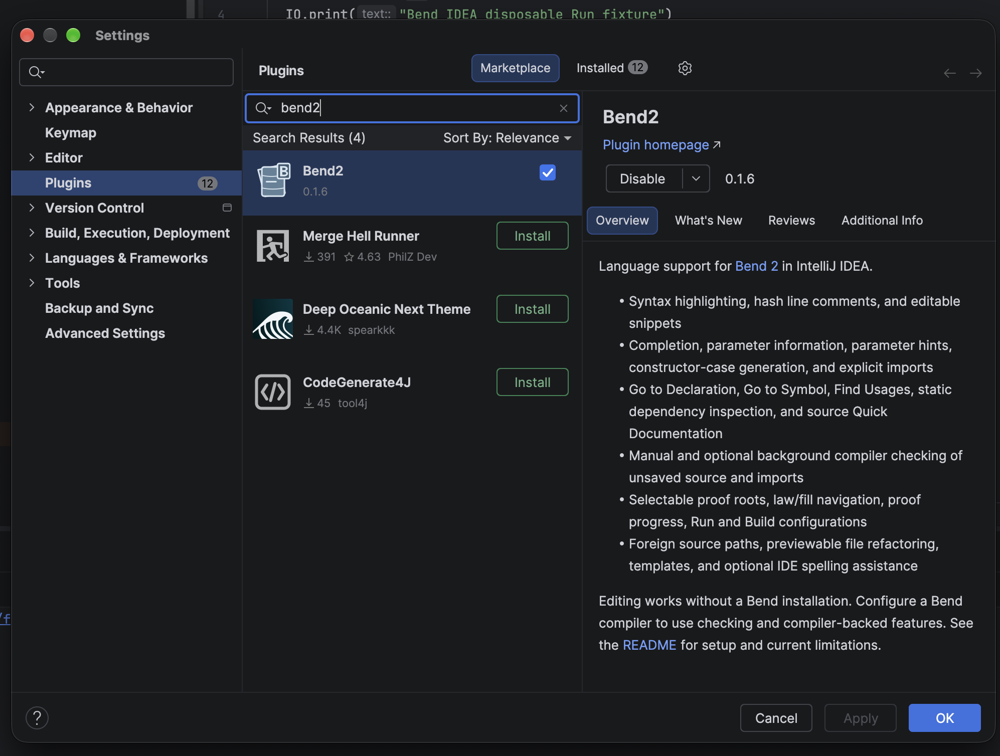
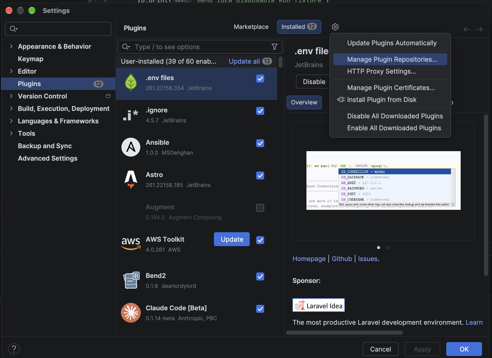
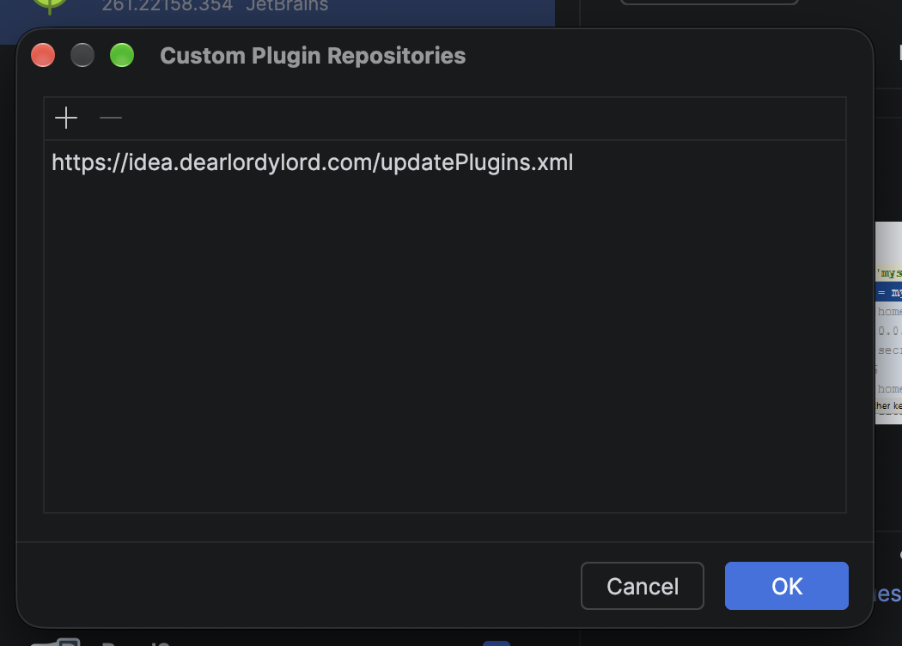

# Bend2 Idea Plugin


Language support for [Bend 2](https://github.com/bendlang/bend) in IntelliJ IDEA. The plugin recognizes `.bend` files and provides source editing features without a Bend installation. Compiler diagnostics use a separately configured Bend executable.

[Bend2 plugin website](https://bend-idea.dearlordylord.com/) · [Install instructions](https://bend-idea.dearlordylord.com/#install) · [Standalone formatter](#standalone-formatter-and-style-checker)

<!-- Keep installation guidance focused on user tasks; put version history in CHANGELOG.md and release notes. -->
## Install

- Open **Settings → Plugins → Marketplace**, search for **Bend2**, and install it from [JetBrains Marketplace](https://plugins.jetbrains.com/plugin/34452-bend2). Restart IDEA if prompted.

  

- To enable compiler checks, open **Settings → Languages & Frameworks → Bend** and select your Bend executable and Base source. Editing works without them.

Supports IntelliJ IDEA **2025.1 and newer**. Compatibility has been verified with Community 2025.1 and Ultimate 2026.1.

## Features

### Editing and completion

- Syntax highlighting with configurable Bend colors, light and dark file icons, and hash line-comment toggling.
- Keyword completion and editable snippets for `def`, `type`, `law`, `match`, `do`, and `import`.
- Source-aware completion for declarations, constructors, parameters, local bindings, match cases, do blocks, and proof binders. Suggestions can show source signatures and nearby comments.
- Completion from the selected Base source and direct imports, including qualified names and unsaved changes in open files. Import paths complete from local files, directories, and cached packages without downloading them.
- Parameter information, parameter-name hints, source semantic highlights, constructor-case generation, and an explicit import action for unresolved names.
- Token-aware spelling for comments and supported string text, using the IDE's spellchecker dictionaries and fixes.

To distinguish resolved constructors from ordinary calls, open **Settings → Editor → Color Scheme → Bend → Resolved constructor**, disable inherited attributes, and choose a foreground color. The default inherits the scheme’s function-call color, which may be white. **Resolved import alias** has its own configurable category. These semantic colors require resolvable declarations or imports; an unresolved name is not colored as a constructor.

### Structure and refactoring

- The structure view lists definitions, laws, data types, and constructors, and navigates to their source.
- Folding, indentation, paired delimiter and quote editing, and conservative source-preserving formatting for supported syntax.
- Reference-aware rename for declarations and local bindings, including related law/fill names. Unsafe renames that cause conflicts or capture are rejected.

### Navigation and documentation

- Go to Declaration for resolved local, imported, and Base names, including import aliases and literal dotted names.
- Find Usages and Highlight Usages for resolved source references across the project.
- Quick Documentation for source declarations, signatures, comments, and law/fill relationships. It shows source information, not inferred expression types.
- Go to Symbol across project sources and configured Base, plus navigable direct call and module-import relationships. Dependency inspection reports unresolved named calls and explains that it is not a complete runtime call graph.
- Previewable file moves and renames update relative Bend module and foreign C/JavaScript paths.

### Proof and project workflows

- Select and check separate proof roots, navigate law/fill links and holes, and inspect source proof progress alongside the root-owned compiler result.
- Generate law fills and constructor matches with explicit unfinished `?TODO` bodies.
- Run Bend programs, build emitted code, and run native artifacts through separate configurations.
- Create a Bend module or a linked `LAWS.bend`/`PROOF.bend` pair from editable file templates.

### Compiler checking

- **Check Current Bend File** runs a supported Bend compiler against a snapshot of the current unsaved file and its loaded imports, without running `main` or fetching packages.
- Optional background checking refreshes diagnostics after edits to the root or its dependencies. Results belong to the checked root, and older results are discarded when their inputs change.
- The clickable **Bend status-bar indicator** shows checking, passed, stale, incomplete, failed, unavailable, and timeout states, with an unsafe/foreign qualification when applicable. Click it or use **Show Bend Check Status** for compiler output and **Check again**. Compiler errors appear in the editor when their source location can be mapped unambiguously.
- For a pinned Bend 2.0.25 source checkout, the optional structured helper supplies versioned check results without matching CLI prose and can highlight the first compiler error at its exact source range. Copy `bend-structured-launcher.sh` and `bend-structured-helper.ts` from `src/main/resources/semantic` into one directory, make the launcher executable, set `BEND_IDEA_BUN` to Bun 1.4.2 and `BEND_IDEA_BEND_DIR` to that checkout's `bend2` directory in IDEA's environment, then select the launcher as the Bend executable. The helper checks hashes of the pinned compiler sources. Other compilers continue to use the guarded text CLI fallback unless they advertise a compatible check protocol. See the [check protocol](docs/compiler/check-protocol.md) and [compiler support matrix](docs/compiler/support.md).
- **Diagnostics currently report only the first compiler error.** An earlier error in this file or an import can hide later errors, so a missing red highlight does not establish validity. Check the Bend status, fix the reported error, then run **Check Current Bend File** again to reveal the next one. Edits make the previous result stale until rechecked.
- **Inspect Bend Goal** checks the current root and shows the compiler's expected type and local context when the caret is on its first reachable named hole. An earlier compiler error, `?TODO`, a later hole, or an unsupported compiler yields an unavailable message. Named holes remain incomplete proof work.
- **Expression types in Quick Documentation** come from the pinned helper's checked term tree after a successful root check. Hover an exactly mapped expression to see its type alongside any source declaration signature. Failed checks, ambiguous spans, edits and unsupported compiler pairings leave the type unavailable.
- **Expected-type completion** uses the current inspected goal to rank local binders that the pinned Bend checker accepts at that hole. It replaces only the selected hole with the chosen name. Source scope still controls candidates; ordinary completion remains available when comparison is unsupported or times out. This first comparison capability covers up to 32 local binders at the first reachable named hole.
- **Explain Bend Resources** rechecks up to eight compiler-context binders as possible replacements for the first named hole. It shows the compiler's erased, affine or reusable quantity and whether each replacement checks in the complete selected root, reaches a later TODO, is rejected, or could not be checked. A rejection can have a non-resource cause, and the view does not claim to track remaining resources at arbitrary expression locations. The action leaves source untouched.
- **Normalize Bend Expression** explicitly rechecks the selected root, then displays a normalized result when the caret is on a closed expression with an exact compiler span. The helper runs in a killable process with a five-second limit; open expressions, unsupported locations and timed-out reductions remain unavailable. Normalization never edits the file.
- **Try Bend Reflexivity** checks a `{==}` replacement for the first reachable named hole in a definition body against a derived snapshot of the selected root. After the compiler accepts the candidate, a confirmation applies one undoable edit. The preview says whether the whole root is complete or later `?TODO` holes remain; rejected or stale candidates leave the source untouched.

## Compiler and release details

See the [changelog](CHANGELOG.md) for released changes and work awaiting release.
The plugin's **What's New** text is maintained separately in
[`plugin.xml`](src/main/resources/META-INF/plugin.xml) when a release is prepared.

The latest release checks used **Bend 2.0.25** from commit [`ff7a40cc9070a34c78399ecd2bbe46a044ad9b4b`](https://github.com/bendlang/bend/commit/ff7a40cc9070a34c78399ecd2bbe46a044ad9b4b), with Bun 1.4.2. If the configured compiler, Base, or another required capability is unavailable, the plugin reports that state instead of treating the file as successfully checked.

### Alternative installation

To use the custom plugin repository, open **Settings → Plugins**, click the gear icon, and choose **Manage Plugin Repositories**.



Add `https://idea.dearlordylord.com/updatePlugins.xml` and click **OK**. If that address cannot be reached, use `https://bend-idea-plugins.pages.dev/updatePlugins.xml`.



Search for **Bend2** in the Plugins Marketplace tab and install it. The custom feed currently serves 0.1.12.

To install a signed ZIP directly, download [`bend-idea-0.1.12-signed.zip`](https://github.com/dearlordylord/bend-idea/releases/download/v0.1.12/bend-idea-0.1.12-signed.zip) and choose **Settings → Plugins → gear icon → Install Plugin from Disk**. Before installation, IDEA may warn about this release's self-signed plugin certificate. Download the [public signing certificate](https://github.com/dearlordylord/bend-idea/releases/download/v0.1.12/bend-idea-signing-certificate.crt) and add it under **Settings → Plugins → Manage Plugin Certificates**. The [release](https://github.com/dearlordylord/bend-idea/releases/tag/v0.1.12) records the signed ZIP's SHA-256 so you can check your download. Use the named signed ZIP, not GitHub's automatic source-code ZIP.

## Planned

- **Broader compiler assistance:** goals beyond the first named hole, general resource demand at arbitrary expressions, expected-type ranking for nonlocal declarations, contextual normalization of open expressions, and more proof edits require additional compatible compiler capabilities. Structured diagnostics currently cover the first compiler error for the pinned helper pairing; broader diagnostic coverage remains planned.

The [implementation specification](https://github.com/dearlordylord/bend-idea/issues/1) and [feature issues](https://github.com/dearlordylord/bend-idea/issues) track the full roadmap.

## Standalone formatter and style checker

The console tool checks formatting and can fix it using the same conservative policy as **Reformat Code**. It reads local source files and EditorConfig; it does not perform semantic linting or compiler checking.

### Install `bend-format`

Download the archive for your machine from the [latest release](https://github.com/dearlordylord/bend-idea/releases/latest) and extract it:

| Your machine | Download |
|---|---|
| Linux Intel/AMD 64-bit | [Linux x64](https://github.com/dearlordylord/bend-idea/releases/download/v0.1.12/bend-format-0.1.12-linux-x64.tar.gz) |
| Linux ARM64 | [Linux ARM64](https://github.com/dearlordylord/bend-idea/releases/download/v0.1.12/bend-format-0.1.12-linux-aarch64.tar.gz) |
| macOS Intel | [macOS Intel](https://github.com/dearlordylord/bend-idea/releases/download/v0.1.12/bend-format-0.1.12-macos-x64.tar.gz) |
| macOS Apple Silicon | [macOS Apple Silicon](https://github.com/dearlordylord/bend-idea/releases/download/v0.1.12/bend-format-0.1.12-macos-aarch64.tar.gz) |
| Windows Intel/AMD 64-bit | [Windows x64](https://github.com/dearlordylord/bend-idea/releases/download/v0.1.12/bend-format-0.1.12-windows-x64.zip) |

Keep the extracted directory together and add its `bin` directory to your PATH:

- **Linux/macOS:** move the extracted directory to `~/tools/bend-format`, then add `export PATH="$HOME/tools/bend-format/bin:$PATH"` to your shell profile (`~/.zshrc` or `~/.bashrc`). Open a new terminal.
- **Windows:** move the extracted directory to a permanent location, open **Edit environment variables for your account → Path → Edit → New**, and add the full path to its `bin` directory. Open a new terminal. PowerShell and Command Prompt both accept `bend-format`.

To try it before changing PATH, open a terminal in the extracted directory and run `./bin/bend-format --version` on Linux/macOS, or `bin\bend-format.cmd --version` in Windows Command Prompt. If the path contains spaces, quote it; in PowerShell use `& 'C:\path to\bend-format\bin\bend-format.cmd' --version`.

### Format a project

Run these commands from your project directory:

```sh
bend-format --version
bend-format check src/main.bend src/types.bend
bend-format fix src/main.bend src/types.bend
```

The tool is ready to run after extraction and works offline. `check` reports files that need formatting; `fix` applies safe formatting changes.

Pass one or more explicit `.bend` paths. `check` never writes files or the Git index. `fix` changes only safe working-tree files and leaves unavailable files intact. Files in a batch are processed independently, even if another file is unavailable.

| Exit | `check` | `fix` |
|---|---|---|
| `0` | All files conform. | All files conform or were safely formatted. |
| `1` | At least one file would change. | — |
| `2` | A file is unavailable or the command cannot run. | A file is unavailable or the command cannot run; safe files may already have been formatted. |

### EditorConfig and wrapping

Place an `.editorconfig` in your project; the IDE formatter and console tool share these settings:

```ini
root = true

[*.bend]
indent_style = space
indent_size = 2
tab_width = 4
bend_max_line_length = 100
```

- `bend_max_line_length` accepts a positive integer or `off`. Absent or `unset` uses the default **100 visual columns**. `off` preserves existing breaks while allowing safe spacing. Invalid values make formatting unavailable. This is a Bend-specific extension, not a standard EditorConfig property.
- `indent_style`, `indent_size` (including `tab`) and `tab_width` follow shared indentation decoding. Tab width controls visual tab stops independently of space indentation; tab indentation uses tabs plus any remaining spaces. Unsupported standard-property values are ignored individually, preserving other valid settings.
- Nested and inherited overrides work, including sections that set only the line width. When IntelliJ’s EditorConfig support is disabled in Code Style settings, Bend typing and formatting use IDE defaults. The console tool always reads local EditorConfig files. If the optional IDE EditorConfig plugin is absent, Bend retains local property lookup. Generic save properties remain owned by IntelliJ.

Wrapping applies to complete constructor patterns, constructor expressions, calls and definition parameter lists. Recognized overlong multiline lists reflow; fitting multiline grouping remains intact. Names, literals, operators, dependent annotations and arbitrary proof terms stay intact, even when they exceed the soft limit. Comments, line endings and the presence or absence of a final newline are preserved. Header-looking text inside multiline literals remains literal text.

Incomplete source, unsupported layout, unsafe comment attachment, significant newlines that could change call/index parsing, and mixed line endings requiring inserted breaks yield `unavailable` without edits to that file. The formatter does not reflow arbitrary expressions, imports or comments.

In IntelliJ, invoke **Reformat Code** on the whole file, or use **Select All → Reformat Code**; omitting surrounding whitespace or the final newline from that selection still allows wrapping. Partial selections apply only safe horizontal spacing. The opt-in **Actions on Save** and **Commit Checks** use the same formatter. Enter and Backspace stay conservative where tab normalization could change physical body ownership. See [manual feature verification](docs/manual-verification.md).

### Hooks, CI and building the tool

The sample [pre-commit hook](contrib/hooks/pre-commit) checks staged `.bend` content, including partially staged files. After building the tool, copy it into `.git/hooks/pre-commit` and make it executable. The [all-tracked-files script](ci/bend-format-all-tracked.sh) checks working-tree content; the [CI example](docs/examples/bend-format-ci.yml) builds the tool and runs that script. Neither invokes compiler checking.

### Alternative download and building from source

`--version` reads packaged build metadata, independent of the JAR filename. Missing or blank metadata exits `2`; formatting commands remain usable.

For users who already manage Java, the smaller [portable JAR](https://github.com/dearlordylord/bend-idea/releases/download/v0.1.12/bend-format-tool-0.1.12.jar) requires Java 21 or newer:

```sh
java -jar bend-format-tool-0.1.12.jar check src/main.bend
java -jar bend-format-tool-0.1.12.jar fix src/main.bend
```

The standard archives include a private Java runtime and do not use system Java or JAVA_HOME. Linux builds target glibc distributions and are tested on Ubuntu 22.04; Alpine/musl and Windows ARM64 are not supported. macOS archives are not notarized. Each archive records its runtime provenance and includes license notices. Verify downloads against `BEND-FORMAT-SHA256SUMS.txt` on the release page. To update, replace the extracted directory with the new version and keep PATH pointed at its `bin` directory.

Build a runtime archive for your current OS/architecture with JDK 21 and Python 3.12+ using `./gradlew buildFormatDistribution`; validate the extracted archive with `./gradlew testFormatDistribution`. Select a non-default Python executable with `-PformatDistributionPython=/path/to/python3.12`. Output is under `build/distributions/bend-format/`. Packaging derives the required Java modules with `jdeps`, includes runtime/dependency notices and records runtime provenance. The [distribution workflow](.github/workflows/formatter-distributions.yml) builds and tests each native platform against an existing release JAR before optionally attaching all archives. See the [packaging research](research/bend-format-cli-distribution.md) for the decision and tradeoffs.

Build the portable JAR from source with JDK 21 using `./gradlew buildFormatTool`. Select the artifact by its generated name rather than hardcoding a release version:

```bash
shopt -s nullglob
tools=(build/libs/bend-format-tool-*.jar)
if ((${#tools[@]} != 1)); then
  echo "Expected exactly one built formatter; clean build/libs and rebuild." >&2
  exit 2
fi
tool="${tools[0]}"
java -jar "$tool" --version
java -jar "$tool" check path/to/main.bend
```

## Build

Use a full **JDK 21**. The Gradle wrapper downloads the pinned build tools and IDE dependencies as needed. Distributions must always be signed. Keep `private.pem` and `chain.crt` outside the repository in the directory named by `BEND_IDEA_SIGNING_DIR`.

The real compiler tests in `./gradlew check` require `BEND_TEST_COMPILER_DIR` to name a clean Bend checkout and `BEND_TEST_BUN` to name an absolute Bun executable. The approved Bend commit and the exact Bun version/revision are recorded in [`ci/bend-test-toolchain.properties`](ci/bend-test-toolchain.properties); the test gate fails before running tests if either supplied input is missing or mismatched. CI checks Bend out separately under `_ci/bend`, provisions Bun at the recorded release, and logs both inputs before the gate. Local test runs can use any clean checkout of the recorded Bend commit and Bun executable matching the recorded version and revision; supplied `.references` checkouts are not changed.

The [Bend release compatibility workflow](.github/workflows/bend-releases.yml) polls published Bend releases every six hours and can be run manually with a specific tag. It checks each release newer than the approved pin using the release's SHA-256-verified Linux archive, its compiler and matching Base, then exercises **Check Current Bend File** for complete, TODO/named-hole, failed, unsafe/foreign and side-effecting-main cases, plus parsing, navigation, conservative formatting with compiler comparisons, and unsaved imported-source diagnostics. Results include the compatibility-suite identity and tested plugin commit and are recorded on the `bend-release-results` branch and in the workflow summary; a failed release can be retried with the manual `release_tag` input. This compatibility smoke test does not change the pinned `./gradlew check` gate or claim support for the pinned-source structured helper on a new compiler. Older basic-smoke results are queued again under `editor-compatibility-v2`. Each run checks up to 20 candidates after Bend 2.0.25; later polls continue any backlog. A local release smoke run uses `BEND_TEST_CURRENT_COMPILER=/absolute/path/to/bend/bin/bend BEND_TEST_CURRENT_BASE=/absolute/path/to/bend/bend2/base.bend ./gradlew -PbendReleaseSmoke=true test` with JDK 21.

```sh
BEND_TEST_COMPILER_DIR=/absolute/path/to/bend \
BEND_TEST_BUN=/absolute/path/to/bun \
  ./gradlew check
```

```sh
./gradlew check                 # editor fixtures, warnings, formatting, policy lint and negative probes
./gradlew verifyPlugin          # check compatibility with the pinned IDEA versions
BEND_IDEA_SIGNING_DIR="$HOME/.config/bend-idea/signing" \
  ./gradlew signPlugin verifyPluginSignature  # build and verify the signed ZIP
./gradlew runIde                # launch an IDE sandbox
```

Install only `build/distributions/*-signed.zip` with **Settings → Plugins → Install Plugin from Disk**. If using the local self-signed certificate, add `chain.crt` under **Settings → Plugins → Manage Plugin Certificates**. `buildPlugin` creates an unsigned intermediate; never distribute it. After signature verification, remove unsigned ZIPs from `build/distributions/`. CI uploads a plugin archive only when the repository secrets `BEND_IDEA_SIGNING_PRIVATE_KEY` and `BEND_IDEA_SIGNING_CERTIFICATE_CHAIN` are configured and signing succeeds. The plugin is implemented in Scala 3; Gradle uses Kotlin build scripts.

For the design and contribution rules, see [ARCHITECTURE.md](ARCHITECTURE.md), [CONTEXT.md](CONTEXT.md), [AGENTS.md](AGENTS.md), and [REVIEWER.md](REVIEWER.md).

## License

[Apache-2.0](LICENSE)
